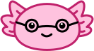

  
<h1>accessolotl</h1>
<h3>your place to learn web-accessibility</h3>

 

## Table Of Contents

* [About the Project](#about-the-project)
* [Authors](#authors)

## About the Project

Our Project aims to teach society how important web-accessibility is. We want to show what an accessible website means to disabled people and how it can improve their experience. Are you ready to learn about the importance of implementing accessibility features?
#### Visit us at [accessolotl.netlify.app](https://accessolotl.netlify.app/)!

## Authors

Created by 3 students of [HTL Rennweg](https://www.htl.rennweg.at/) located in Vienna, Austria.
* [@Pycxtv](https://github.com/Pycxtv)
* [@dasechtelima](https://github.com/dasechtelima)
* [@felixwollmann](https://github.com/felixwollmann)
